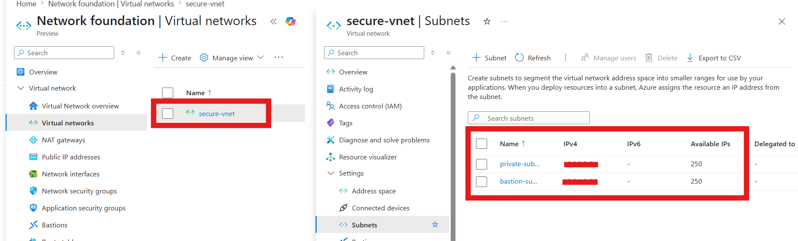
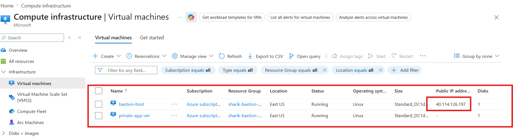
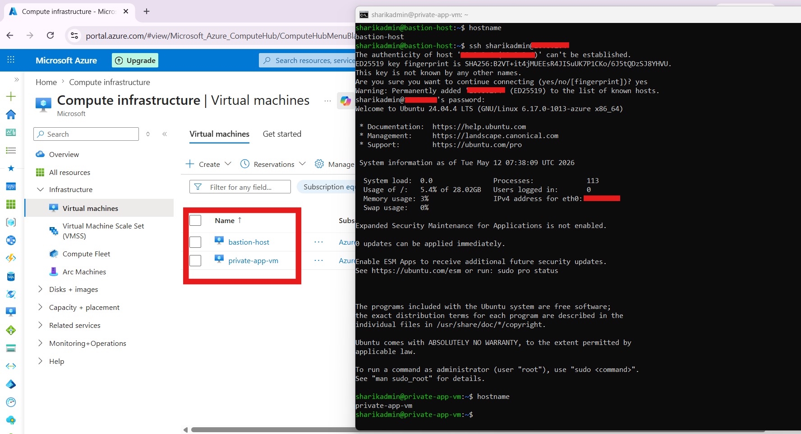

# 🔐 Secure Azure Architecture with Bastion Host (Terraform IaC)

---

## 📌 Overview

This project shows how to build a secure cloud setup on Azure using Terraform.

The main goal is to protect backend servers from the public internet and allow access in a safe and controlled way.

Instead of giving public access to all servers, we use a Bastion Host (Jump Server) as a single entry point.

---

**❓ Why Bastion Host is Used**

A Bastion Host is used to securely access private servers.

Without Bastion:

**Every VM needs a Public IP ❌**
****Higher security risk ❌**

With Bastion:

- Only one VM has Public IP ✅
- All other VMs stay private ✅
- Access is controlled and secure ✅

👉 Simple line:

**Bastion Host acts like a secure gate to enter a private network**.

---

## 🏗️ Project Structure

- providers.tf → Azure provider setup
- main.tf → VNet, Subnet, NSG
- compute.tf → Virtual Machines
- variables.tf → Input variables
- terraform.tfvars → Actual values
- outputs.tf → Shows IPs after deploy

---

**🚀 How to Deploy**

- terraform init
- terraform validate
- terraform plan
- terraform apply

---

## 🛠️ Implementation Phases

**🚧 Phase 1: Networking Setup**.

In this phase we created:

- Resource Group
- Virtual Network (VNet)
- Public & Private Subnets
- Network Security Groups (NSG)
- NIC and Public IP

**👉 Private subnet is secured and only allows access from Bastion**

---

## 💻 Phase 2: VM Deployment

**We created two Virtual Machines**:

- Bastion Host (Jump Server)
  → Has Public IP
- Private VM (Secure Zone)
  → Only Private IP (no internet access)

---

## 🔐 Phase 3: Secure Access (SSH Jump)

**Step 1: Login to Bastion**

- ssh sharikadmin@<BASTION_PUBLIC_IP>

**Step 2: Connect to Private VM from Bastion**

- ssh sharikadmin@<PRIVATE_VM_INTERNAL_IP>

**👉 This is called SSH Jump**

---

**🛡️ Security Features**

- No Public IP on Private VM
- Access only through Bastion
- NSG rules for restricted traffic
- Secure internal communication

---

**🧪 Testing**

- Private VM not accessible from internet ✔
- Successfully connected using Bastion ✔
- Network rules working correctly ✔

---

### 💼 Real-World Use

**Used In**

- Banking apps
- Company internal systems
- Secure backend environments

---

**🛠️ Tech Stack**

- Microsoft Azure
- Terraform
- Ubuntu 24.04
- Networking (VNet, NSG)

---

**🔥 Key Takeaway**

- Keep backend servers private. Use Bastion Host for secure access.

## 👨‍💻 Author

**Sharik – DevOps Engineer**