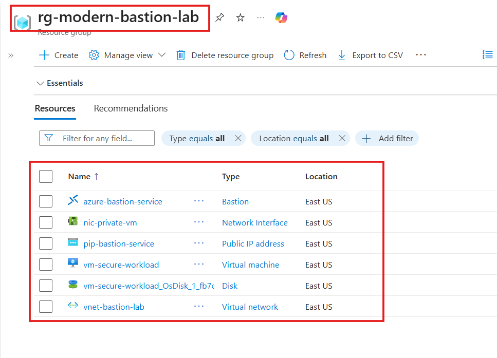

# 🔐 Secure Cloud Architecture: Azure Bastion PaaS Deployment via Terraform

---

## 📌 Introduction

**Azure Bastion** is a fully managed Platform-as-a-Service (PaaS) solution in Microsoft Azure that provides secure and seamless RDP/SSH connectivity to Virtual Machines **without exposing them to the public internet**.

In traditional setups, Virtual Machines require a Public IP or a jump server (bastion VM) for remote access, which increases the attack surface and security risks. Azure Bastion eliminates this need by enabling access directly through the Azure Portal over a secure TLS connection (Port 443).

This project demonstrates how to deploy a **secure, production-grade architecture** using Terraform, where:
- The Virtual Machine has **no Public IP**
- All access is routed securely via **Azure Bastion**
- The infrastructure follows modern **Zero Trust security principles**

---

## 💡 Why Azure Bastion?

- 🚫 **Zero Public IPs:**  
  The workload Virtual Machine remains entirely private, protecting it from brute-force internet attacks.

- 🛠️ **No Maintenance:**  
  No need to manage, patch, or secure a separate jump server.

- 🌐 **Browser-Based Access:**  
  Secure SSH/RDP access directly from the Azure Portal over TLS (Port 443).

---

## 📂 Repository Structure & Code Overview

The project follows a modular Infrastructure as Code (IaC) design:

- **`provider.tf`**  
  Initializes the Azure Resource Manager (`azurerm`) provider.

- **`variable.tf`**  
  Stores reusable variables like region, naming, and VM configuration.

- **`terraform.tfvars`**  
  Contains environment-specific values and sensitive data (e.g., passwords).

- **`main.tf`**  
  Defines networking resources:
  - Virtual Network (VNet)
  - Subnets (including Azure Bastion subnet)
  - Azure Bastion instance

- **`compute.tf`**  
  Deploys a private Linux VM with:
  - No Public IP  
  - Private Network Interface only  

---

## 🚀 Step-by-Step Validation & Connection Guide

After running `terraform apply`, follow these steps:

### ✅ Step 1: Locate the Private VM
1. Log in to the Azure Portal
2. Search for **Virtual Machines**
3. Select **`vm-secure-workload`**

---

### 🔗 Step 2: Access Bastion
1. Go to **Connect**
2. Select **Bastion**

---

### 🔑 Step 3: Enter Credentials
- **Username:** `azureuser`
- **Authentication Type:** Password
- **Password:** (from `terraform.tfvars`)

Click **Connect**

---

### 💻 Step 4: Terminal Verification

Run this command inside the VM:

- hostname -I

---

#### 📸 Architecture Validation & Results

**🖼️ Screenshot 1: Azure Resources deployed via Terraform inside the Resource Group**.

Shows:

- Bastion Host
- VNet
- Public IP
- Virtual Machine

---

**🖼️ Screenshot 2: Workload VM showing Private IP only with NO Public IP attached**.

Shows:

- Public IP: None
- Private IP only

1[vm](./no-pip.png)

---

**🖼️ Screenshot 3: Bastion SSH Session**

Shows:

- Browser-based SSH terminal
- Output of hostname -I

1[bastion](./final-bastion.png)

---

### 🎯 Key Outcome

- ✔ Secure access to VM without exposing it to the internet
- ✔ Fully managed PaaS-based bastion solution
- ✔ Production-grade cloud security architecture

#### 🧠 Learning Highlights
- Azure Networking (VNet, Subnets)
- Bastion PaaS Architecture
- Terraform Modular Design
- Secure VM Access (No Public IP)

**⚡ Author**

- Built with 💙 using Terraform & Azure